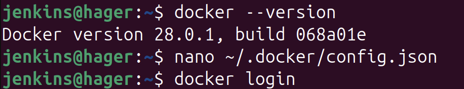
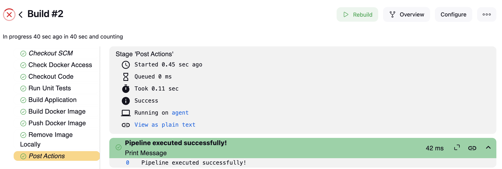

# 🚀 Jenkins Pipeline with Shared Library & SSH Agent

This guide covers setting up a Jenkins pipeline using a shared library and configuring a Jenkins agent via SSH.

and this the link to the shared library:
https://github.com/Hager706/shared-library.git

## 📌 Pipeline Stages
The pipeline consists of the following stages:

1. **RunUnitTest** - Runs unit tests using Maven.
2. **BuildApp** - Builds the application using Maven.
3. **BuildImage** - Builds a Docker image from the Dockerfile.
4. **PushImage** - Pushes the Docker image to a registry.
5. **RemoveImageLocally** - Removes the image from the local machine.

## 🏗️ Setup Jenkins SSH Agent

### 1️⃣ Create the `jenkins` User on the Target Server
```bash
sudo adduser jenkins
sudo usermod -aG sudo jenkins  
```

### 2️⃣ Generate SSH Keys for `jenkins`
```bash
sudo -u jenkins bash
ssh-keygen -t rsa -b 4096 -C "jenkins@192.168.105.11"
```
Save the key in the default location: `/home/jenkins/.ssh/id_rsa`.

### 3️⃣ Configure SSH Permissions
```bash
chmod 700 /home/jenkins/.ssh
chmod 600 /home/jenkins/.ssh/id_rsa
chmod 644 /home/jenkins/.ssh/id_rsa.pub
```

### 4️⃣ Add Public Key to `authorized_keys`
```bash
cat /home/jenkins/.ssh/id_rsa.pub >> /home/jenkins/.ssh/authorized_keys
chmod 600 /home/jenkins/.ssh/authorized_keys
```

### 5️⃣ Update SSH Configuration
Edit the SSH server config:
```bash
sudo nano /etc/ssh/sshd_config
```
Add or update:
```bash
PubkeyAuthentication yes
AuthorizedKeysFile .ssh/authorized_keys
PubkeyAcceptedAlgorithms +ssh-rsa
AllowUsers hager jenkins
```
Restart SSH service:
```bash
sudo systemctl restart sshd
```

### 6️⃣ Add Private Key to Jenkins Credentials
```bash
cat /home/jenkins/.ssh/id_rsa
```
1. Go to **Manage Jenkins > Credentials > System > Global credentials**.
2. Click **Add Credentials**.
3. Fill in the following:
   - **Kind**: SSH Username with private key
   - **ID**: `jenkins`
   - **Username**: `jenkins`
   - **Private Key**: Paste the private key content
4. Save.

### 7️⃣ Configure the Jenkins Agent
1. Go to **Manage Jenkins > Nodes > New Node**.
2. Configure as:
   - **Name**: `ubuntu-slave`
   - **Remote Root Directory**: `/home/jenkins/jenkins-slave`
   - **Labels**: `ubuntu`
3. Choose **Launch agents via SSH**.
   - **Host**: `192.168.105.11`
   - **Credentials**: Use ID `jenkins`
4. Save the configuration.

 📸

### 8️⃣ Create the Working Directory
```bash
sudo mkdir -p /home/jenkins/jenkins-slave
sudo chown -R jenkins:jenkins /home/jenkins/jenkins-slave
sudo chmod 755 /home/jenkins/jenkins-slave
```

## ⚙️ Install Dependencies on Agent
### Install Java 17
```bash
sudo apt update
sudo apt install openjdk-17-jdk
java -version
```

### Install Docker
```bash
sudo apt update
sudo apt install -y apt-transport-https ca-certificates curl software-properties-common
curl -fsSL https://download.docker.com/linux/ubuntu/gpg | sudo gpg --dearmor -o /usr/share/keyrings/docker-archive-keyring.gpg
echo "deb [arch=$(dpkg --print-architecture) signed-by=/usr/share/keyrings/docker-archive-keyring.gpg] https://download.docker.com/linux/ubuntu $(lsb_release -cs) stable" | sudo tee /etc/apt/sources.list.d/docker.list > /dev/null
sudo apt update
sudo apt install -y docker-ce docker-ce-cli containerd.io
sudo systemctl enable docker
sudo systemctl start docker
```
Verify installation:
```bash
docker --version
```

 📸

### Install Kubernetes CLI (kubectl)
```bash
sudo apt update && sudo apt install -y kubectl
```

### Configure Docker & Kubernetes Credentials
On the agent:
```bash
mkdir -p ~/.kube ~/.docker
chmod 700 ~/.kube ~/.docker
sudo usermod -aG docker jenkins
sudo systemctl restart ssh
```
On the master:
```bash
scp ~/.docker/config.json jenkins@192.168.105.11:~/.docker/config.json
scp ~/.kube/config jenkins@192.168.105.11:~/.kube/config
```
 📸

## 📦 Create a Shared Library
**Folder structure:**
```
shared-library/
│
├── vars/
    ├── runUnitTests.groovy
    ├── buildApp.groovy
    ├── buildImage.groovy
    ├── pushImage.groovy
    └── removeImageLocally.groovy
```

### Configure Jenkins to Use the Shared Library
1. Go to **Manage Jenkins > Configure System**.
2. Scroll down to **Global Pipeline Libraries**.
3. Add a new library:
   - **Name**: `shared-library`
   - **Default version**: `main`
   - **Source Code Management**: Git
   - **Repository URL**: `<shared_library_repo_url>`
4. Save.

 📸

## 🛠️ Create the Jenkins Pipeline
Create a new pipeline job.

## 🚀 Running the Pipeline
1. Push  **pom.xml**, **Dockerfile**, and **Jenkinsfile** 
2. Run the Jenkins pipeline job.

 📸

## 🎯 Explanation
- **RunUnitTest**: Executes Maven tests.
- **BuildApp**: Compiles the application using Maven.
- **BuildImage**: Creates a Docker image.
- **PushImage**: Uploads the image to a registry.
- **RemoveImageLocally**: Cleans up the image from the system.

